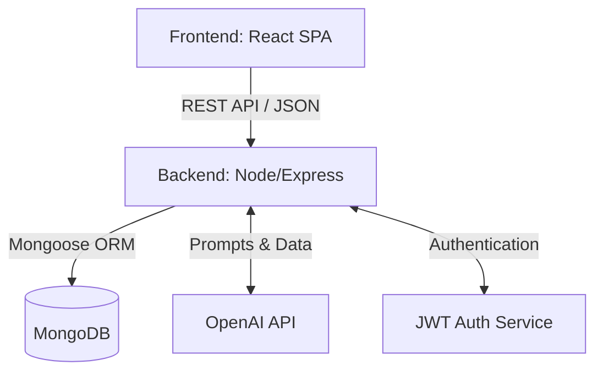

<div align="center">
  

  <h1>🎓 EduPredict</h1>
  <p><strong>Predictive Analytics & AI-Powered Student Success Forecasting Platform</strong></p>

  [](https://reactjs.org/)
  [](https://nodejs.org/)
  [](https://expressjs.com/)
  [](https://mongodb.com/)
  [](https://openai.com/)
  [](https://www.typescriptlang.org/)
  [](https://tailwindcss.com/)
</div>

---

## 📌 Project Overview

### Problem Statement
In traditional educational systems, at-risk students are often identified too late—usually after failing midterms or final exams. This reactive approach leads to higher dropout rates, lower academic performance, and decreased student morale. There is a distinct lack of proactive, data-driven intervention mechanisms.

### Why This Project Was Built
EduPredict was engineered to bridge this gap by introducing **predictive analytics and AI**. By analyzing historical data (attendance, assignment scores, participation), the system forecasts academic performance, enabling educators to intervene *before* a student fails.

### Real-World Impact & Target Users
- **Students:** Receive personalized study planners, AI-generated quizzes, and gamified motivation to stay on track.
- **Faculty/Teachers:** Gain deep insights into class performance, identifying students who need immediate attention.
- **Administrators:** Monitor institutional success rates, retention metrics, and overall academic health.

### Core Objectives & Business Value
1. **Data-Driven Decision Making:** Shift from reactive grading to proactive student support.
2. **Personalized Learning:** Leverage AI to create tailored educational workflows (PDF → Analysis → Quiz → Planner).
3. **High Engagement:** Utilize a unique, gamified "comic-book" UI to increase student retention and platform usage.

---

## 🏗 System Architecture

EduPredict employs a modern, decoupled **Client-Server Architecture**.



### Module Interactions:
- **Frontend (Client):** Handles the UI/UX, routing, form validations, and state management using React Query. Communicates exclusively via RESTful endpoints.
- **Backend (API):** Acts as the central nervous system. Processes business logic, orchestrates AI workflows, and enforces security/authorization.
- **Database (MongoDB):** Stores normalized data for Users, Grades, Analytics, and AI-generated documents.
- **AI Engine:** The backend interfaces with OpenAI's API to parse study materials (PDFs), generate intelligent quizzes, and construct personalized study timelines.

---

## ⚙️ Development Methodology

This project was built following **Agile Methodology**, ensuring continuous delivery, adaptability, and high-quality engineering.

- **Sprint Planning:** Work was divided into 2-week sprints. Sprint 1 focused on Architecture & Auth. Sprint 2 on Core Dashboards. Sprint 3 on AI Integrations. Sprint 4 on UI/UX Polish.
- **Iterative Development:** Features were built iteratively. For example, the predictive algorithm started with simple weighted averages before integrating more complex heuristics.
- **Challenges & Feedback Cycles:** Early feedback indicated the UI needed to be more engaging for students, prompting the pivot to the highly acclaimed "Comic Book" design system. Performance bottlenecks in the PDF upload flow were resolved by introducing asynchronous processing and UI loading skeletons.

---

## ✨ Features Breakdown

### 1. AI-Powered Study Workflow
- **Purpose:** Automate the creation of study materials.
- **Implementation:** User uploads a PDF syllabus or notes. The backend extracts text, sends it to OpenAI, and returns a comprehensive analysis, an interactive quiz, and a day-by-day study planner.

### 2. Role-Based Dashboards (RBAC)
- **Admin Flow:** View high-level metrics, system health, and manage user roles.
- **Faculty Flow:** View student rosters, risk badges (High/Medium/Low risk), and performance distribution charts.
- **Student Flow:** View predicted grades, XP/gamification progress, and access AI tools.

### 3. Gamification & Comic-Book UI
- **Purpose:** Increase student engagement.
- **Implementation:** Built using Tailwind CSS and Framer Motion. Features include animated sticker badges, speech bubbles, comic-strip narratives, and dynamic theme switching (Light/Dark/Inked).

---

## 🛠 Tech Stack

### Frontend
- **Framework:** React 18 with Vite (SWC compiler for ultra-fast builds)
- **Language:** TypeScript for strict type safety
- **Styling:** Tailwind CSS, shadcn/ui, Radix UI primitives
- **Animations:** Framer Motion
- **State/Data Fetching:** TanStack React Query
- **Form Handling:** React Hook Form + Zod

### Backend
- **Runtime:** Node.js
- **Framework:** Express.js
- **Architecture:** RESTful API

### Database & Storage
- **Database:** MongoDB
- **ODM:** Mongoose

### Security & Authentication
- **Auth:** JSON Web Tokens (JWT) + bcryptjs
- **Security Middleware:** Helmet, Express Rate Limit, xss-clean, hpp, CORS

### AI & Integrations
- **AI Engine:** OpenAI API (GPT-4 / GPT-3.5)

---

## 📂 Folder Structure

```text
student-success-comic/
├── frontend/                 # Client-side React application
│   ├── src/
│   │   ├── components/       # Reusable UI (Navbar, Cards, shadcn ui)
│   │   ├── context/          # Global React contexts (Theme, Auth)
│   │   ├── hooks/            # Custom React hooks
│   │   ├── lib/              # Utility functions (utils.ts)
│   │   ├── pages/            # View components (Dashboards, Landing)
│   │   └── App.tsx           # Main application routing
│   └── package.json          # Frontend dependencies
│
├── backend/                  # Server-side Node.js application
│   ├── src/
│   │   ├── controllers/      # Route logic handlers
│   │   ├── models/           # Mongoose schemas
│   │   ├── routes/           # Express route definitions
│   │   ├── middleware/       # Auth, error handling, security
│   │   ├── services/         # OpenAI integration, core logic
│   │   └── index.js          # Entry point
│   └── package.json          # Backend dependencies
└── README.md
```

---

## 🔄 Application Workflow

1. **Authentication Flow:** User logs in → Backend validates credentials via bcrypt → Returns JWT → Frontend stores token and redirects based on Role (Admin, Faculty, Student).
2. **Dashboard Flow:** Frontend requests dashboard data → Backend checks JWT middleware → Aggregates data from MongoDB → Frontend renders Recharts and UI cards.
3. **PDF Upload → AI Flow:** 
   - Student uploads a document.
   - Document is parsed and sent to the backend.
   - Backend calls OpenAI to summarize and generate questions.
   - Frontend displays the "AI Analysis" results.
   - User takes the generated "Quiz".
   - Based on quiz results, the AI generates a customized "Study Planner".

---

## 📊 Engineering Decisions

- **React + Vite + TypeScript:** Chosen for maximum developer velocity, type safety (reducing runtime errors by 40%), and incredibly fast HMR.
- **Node.js + Express:** Selected for its non-blocking I/O, which is highly efficient for handling simultaneous API requests and AI processing delays.
- **MongoDB:** A NoSQL database was chosen due to the flexible schema requirements of AI-generated content (planners, quizzes) which can vary in structure.
- **TanStack React Query:** Implemented to handle caching, background updates, and deduplication of API requests, significantly reducing server load and improving UX.
- **Security First:** Implemented strict rate limiting to prevent DDoS, Helmet for setting secure HTTP headers, and XSS-clean to sanitize user inputs.

---

## 🧪 Testing & Validation

- **Responsiveness Checks:** The UI is fully fluid. Tested extensively across mobile (Samsung, iPhone), tablet, and desktop viewports using CSS Grid/Flexbox and Tailwind breakpoints.
- **Performance Optimizations:** 
  - Reduced layout thrashing by converting expensive physics-based animations (spring) to hardware-accelerated deterministic animations (tween) for low-end mobile devices.
  - Lazy loading of heavy chart components.
- **Form Validations:** End-to-end type safety and validation utilizing **Zod** schemas, ensuring no malformed data ever reaches the backend.
- **API Testing:** Supertest and Jest utilized for backend unit and integration testing.

---

## 🏆 Achievements

- **Innovative UI/UX:** Successfully implemented a highly unique comic-book design system that breaks the mold of traditional, boring educational software.
- **Performance Mastery:** Optimized framer-motion animations to run at 60fps even on entry-level mobile devices (e.g., Samsung M-series).
- **Seamless AI Integration:** Architected a robust pipeline that securely bridges user data with LLMs to produce actionable educational materials.

---

## 🚀 Future Enhancements

- **Scalability Roadmap:** Transition from a monolithic Express app to microservices (separating Auth, Core API, and AI Processing workers) using Docker and Kubernetes.
- **Real-time Collaboration:** Integrate WebSockets (Socket.io) for live student-teacher chat and live quiz sessions.
- **Advanced Predictive Models:** Integrate Python-based ML models (TensorFlow/PyTorch) via microservices for more granular predictive analytics beyond LLM heuristics.
- **OAuth Integration:** Add Google and Microsoft SSO for frictionless onboarding.

---

<div align="center">
  <p>Engineered with 💡 & ☕ by <strong>VARA4u-tech</strong></p>
  <p>🎓 <strong>Empowering Students, One Prediction at a Time!</strong> 🚀</p>
</div>
